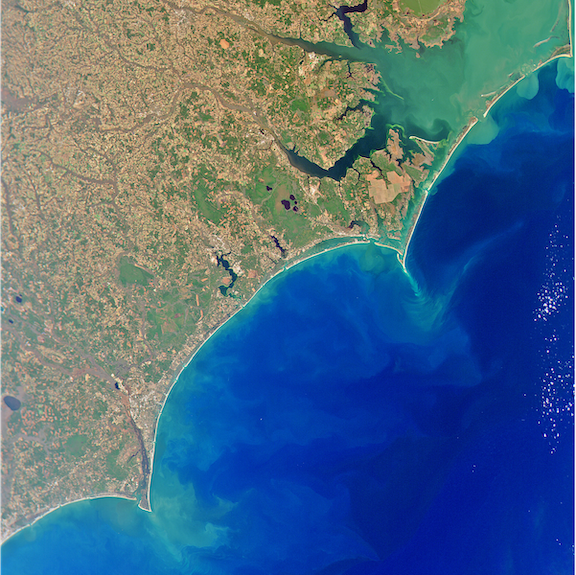
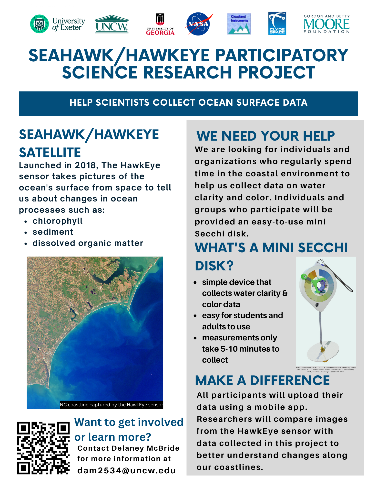
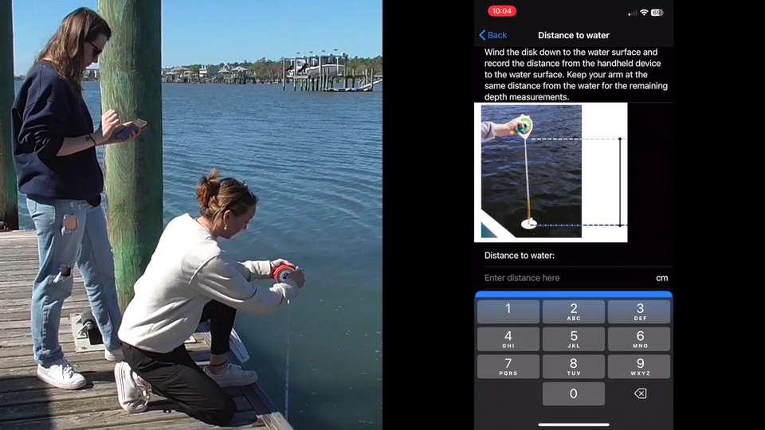
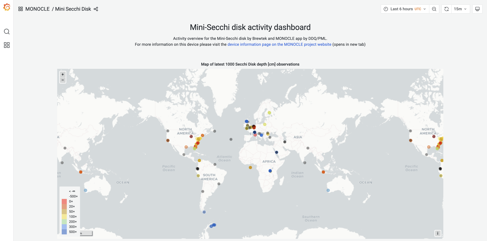
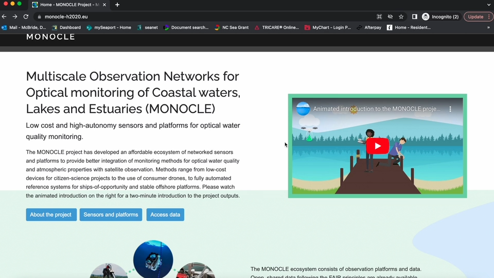
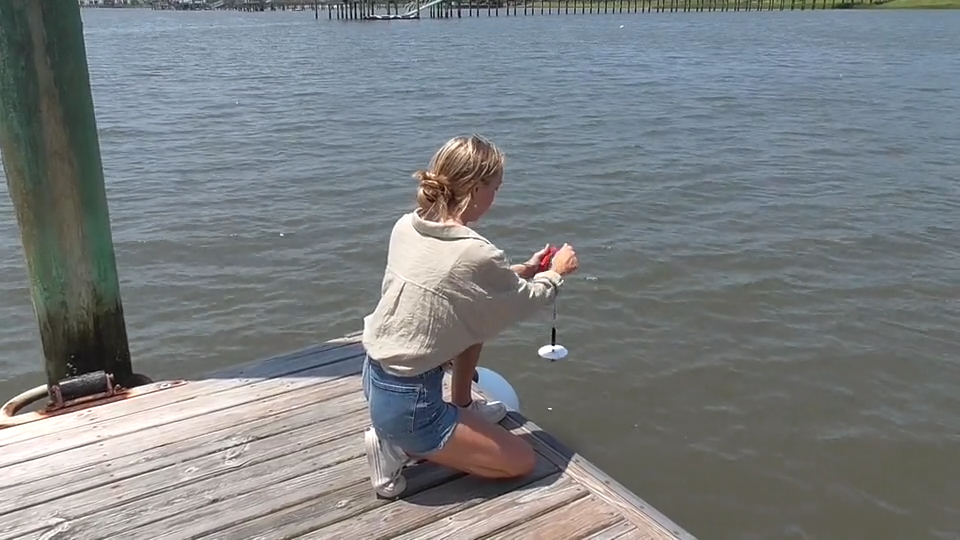

# SeaHawk-HawkEye Participatory Science

# Background 
We have launched a participatory science project as part of the SeaHawk-HawkEye ocean color remote sensing mission. For more information on the broader mission, please visit [SeaHawk-HawkEye Ocean Color Remote Sensing](https://coast-lab.org/seahawk/).

# How-To Resources
See below for several instructional resources covering the following topics:
- How to use the Mini-Secchi Disk
- How to access data on the MONOCLE website
- How to read the measuring tape for the most accurate possible readings
- How to attach extra weight to ensure a vertical downward cast even in stronger currents
- How to take care of your Mini-Secchi disk for optimal performance and longevity

## How to use the Mini-Secchi Disk
[Here are written instructions for using the mini-Secchi disk, followed by an instructional video below](assets/Mini-Secchi-How-To-Guide.pdf "Mini-Secchi How-To Guide").

Click image to watch video:  

If you wish to log data and don't have access to the mobile app, please fill out this [Data Log](assets/Mini-Secchi-Data-Log.pdf "Mini-Secchi Data Log.pdf").

## How to access data on the MONOCLE website
See the [MONOCLE Mini-Secchi disk activity dashboard](https://rsg.pml.ac.uk/dashboards/d/P0tWxs97k/monocle-secchi) to see all of the data collected in this and interrelated projects!  

Please watch the following video for more information on the MONOCLE website and data access (click image to watch video):  
How to read the measuring tape for the most accurate possible readings (click image to watch video):  

## Measuring Tape How-To
How to read the measuring tape for the most accurate possible readings (click image to watch video):  

## Weight Attachment How-To
How to attach extra weight to ensure a vertical downward cast even in stronger currents (click image to watch video):  

<iframe src="https://player.vimeo.com/video/908332326?badge=0&amp;autopause=0&amp;player_id=0&amp;app_id=58479" frameborder="0" allow="autoplay; fullscreen; picture-in-picture" style="position:absolute;top:0;left:0;width:100%;height:100%;" title="Secchi Weight Attachment"></iframe>

## Secchi Disk Maintenance
How to take care of your Mini-Secchi disk for optimal performance and longevity (click image to watch video):  

<iframe src="https://player.vimeo.com/video/908332303?badge=0&amp;autopause=0&amp;player_id=0&amp;app_id=58479" frameborder="0" allow="autoplay; fullscreen; picture-in-picture" style="position:absolute;top:0;left:0;width:100%;height:100%;" title="Secchi Disk Maintenance"></iframe>
